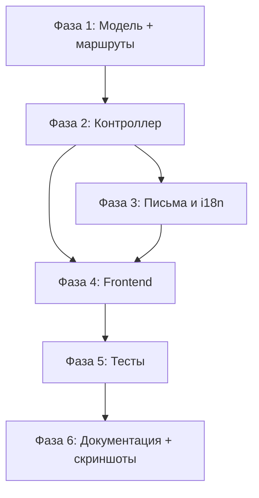

# Implementation Plan: Система сброса пароля

**Spec:** `.memory-bank/features/002-forgot-password/spec.md` (v2.0)  
**Статус:** COMPLETED (04.04.2026)  
**Зависимость:** 001-auth-email **завершена и смержена**.

---

## 1. Grounding: текущий код vs спека

| Ожидание спеки | Факт в репозитории |
| :--- | :--- |
| Devise с `:confirmable`, Inertia-auth из 001 | ✅ `User` с `devise :database_authenticatable, :registerable, :confirmable, :validatable`; контроллеры `sessions`, `registrations`, `confirmations`; Inertia-страницы `auth/Login`, `auth/Register` |
| Колонки `reset_password_token`, `reset_password_sent_at` | ✅ Присутствуют в `db/schema.rb`, индекс unique на `reset_password_token` — **миграция НЕ нужна** |
| `config.reset_password_within` | ✅ Задан `6.hours` в `config/initializers/devise.rb` |
| `config.password_length` | ✅ `6..128` (НЕ 8, как упоминалось ранее) |
| Sidekiq + `deliver_later` | ✅ `config.active_job.queue_adapter = :sidekiq`; `User#send_devise_notification` переопределён для `deliver_later`; Sidekiq 8 в Docker |
| Фабрика `:user` с трейтами | ✅ `spec/factories/users.rb`: трейты `:confirmed`, `:unconfirmed`, `:expired_confirmation` |
| `AuthLayout`, формы Tailwind | ✅ `app/frontend/pages/auth/AuthLayout.tsx`; паттерн `useForm` с вложенной структурой `user: { ... }` |
| `ru.yml` с i18n | ✅ `config/locales/ru.yml`: ключи `auth.login.*`, `auth.register.*`, `auth.confirmation.*`, `auth.errors.*`; `activerecord.errors.models.user.attributes.*` |
| `letter_opener_web` в dev | ✅ Маршрут `/letter_opener`, гем подключён |
| Модуль `:recoverable` в User | ❌ **НЕ подключён** — единственное что нужно активировать |
| Маршрут `passwords` в routes | ❌ **НЕ подключён** в `devise_for` |
| `Users::PasswordsController` | ❌ **Не существует** |
| Страницы `auth/ForgotPassword`, `auth/ResetPassword` | ❌ **Не существуют** |
| Ключи `auth.passwords.*` в `ru.yml` | ❌ **Не существуют** |
| Шаблон `reset_password_instructions.html.erb` | ❌ Используется дефолтный Devise (нет кастомного) |
| Тесты паролей | ❌ **Не существуют** |

**Вывод:** Вся инфраструктура готова. Нужно: 1) активировать модуль, 2) добавить маршрут и контроллер, 3) создать фронтенд-страницы, 4) добавить i18n, 5) кастомизировать письмо, 6) написать тесты, 7) скриншоты.

---

## 2. Конфликты с архитектурой проекта и разрешения

| Правило | Как соблюсти в 002 |
| :--- | :--- |
| Только CRUD в контроллерах | `Users::PasswordsController < Devise::PasswordsController` с `new`, `create`, `edit`, `update` — стандартные действия |
| Кастомная логика (anti-enumeration) | В приватных методах контроллера или concern, если >25 строк |
| Сервис-объекты только для внешних API | Логику оставить в контроллере; PORO не вводить |
| Миграции с согласования | Миграция **НЕ нужна** — колонки уже есть |
| Документация в `/docs` | `docs/features/password-reset.md` после стабилизации |

---

## 3. Зависимости между фазами (граф)



**Критический путь:** модель/маршруты → контроллер → (i18n + письма ∥ фронт) → тесты → доки/скриншоты.

---

## 4. Фазы и атомарные шаги

---

### Фаза 1 — Модель и маршруты

#### Step 1.1 — Активировать `:recoverable` в `User`

**Файл:** `video_chat_and_translator/app/models/user.rb`

**Действие:** Добавить `:recoverable` в список модулей Devise:
```ruby
devise :database_authenticatable, :registerable, :recoverable, :confirmable, :validatable
```

**Проверка:** `User.new.respond_to?(:send_reset_password_instructions)` → `true`.

#### Step 1.2 — Подключить контроллер паролей в routes

**Файл:** `video_chat_and_translator/config/routes.rb`

**Действие:** Добавить `passwords: "users/passwords"` в существующий блок:
```ruby
devise_for :users, controllers: {
  sessions: "users/sessions",
  registrations: "users/registrations",
  confirmations: "users/confirmations",
  passwords: "users/passwords"
}
```

**Проверка:** `bin/rails routes | grep password` показывает маршруты `new_user_password`, `edit_user_password`, `user_password` (POST/PATCH).

**Ожидаемые маршруты:**
- `GET  /users/password/new` → `users/passwords#new`
- `POST /users/password` → `users/passwords#create`
- `GET  /users/password/edit?reset_password_token=...` → `users/passwords#edit`
- `PATCH /users/password` → `users/passwords#update`

---

### Фаза 2 — Контроллер `Users::PasswordsController`

#### Step 2.1 — Создать контроллер

**Файл (создать):** `video_chat_and_translator/app/controllers/users/passwords_controller.rb`

**Имена Inertia-компонентов:** `auth/ForgotPassword`, `auth/ResetPassword` (без `Pages/` префикса).

**Действие:**

1. **`new`** — `render inertia: "auth/ForgotPassword", props: { translations: I18n.t("auth.passwords.forgot") }`
2. **`create`** — Anti-enumeration:
   - Невалидный формат email → render с errors prop
   - Валидный формат → найти пользователя; если `user&.confirmed?` → `user.send_reset_password_instructions`; в **любом** случае redirect с одинаковым flash notice
3. **`edit`** — По `reset_password_token` из query params:
   - Невалидный/просроченный токен → render `auth/ResetPassword` с `token_state: "invalid"`
   - Валидный → render `auth/ResetPassword` с `token_state: "valid"` и `reset_password_token`
4. **`update`** — Смена пароля через Devise; ошибки → render с errors; успех → redirect на `new_user_session_path` с flash
5. **`after_resetting_password_path_for`** → `new_user_session_path`

**Паттерн (по аналогии с `Users::RegistrationsController`):** `skip_before_action :authenticate_user!`; props передаются с translations; ошибки как `errors: Hash`.

---

### Фаза 3 — Письма и локализация

#### Step 3.1 — Шаблон письма сброса

**Файл (создать):** `video_chat_and_translator/app/views/devise/mailer/reset_password_instructions.html.erb`

**Действие:** Тексты через `I18n.t("devise.mailer.reset_password_instructions.*")`. Ссылка с `edit_user_password_url(reset_password_token: @token)`.

**Проверка:** letter_opener_web показывает письмо с рабочей ссылкой.

#### Step 3.2 — Ключи i18n

**Файл:** `video_chat_and_translator/config/locales/ru.yml`

**Действие:** Добавить ключи в существующую структуру:

```yaml
ru:
  auth:
    passwords:
      forgot:
        title: "Забыли пароль?"
        email_label: "Email"
        submit: "Отправить инструкции"
        request_accepted: "Если ваш email зарегистрирован и подтверждён, вы получите письмо с инструкциями по сбросу пароля."
      reset:
        title: "Новый пароль"
        password_label: "Новый пароль"
        password_confirmation_label: "Подтверждение пароля"
        submit: "Сменить пароль"
        token_invalid: "Ссылка для сброса пароля недействительна или просрочена."
        request_again_hint: "Запросить сброс снова"
      login_link:
        forgot_password: "Забыли пароль?"
  devise:
    passwords:
      updated: "Пароль успешно изменён. Войдите с новым паролем."
      send_paranoid_instructions: "Если ваш email зарегистрирован, вы получите письмо с инструкциями."
    mailer:
      reset_password_instructions:
        subject: "Инструкции по сбросу пароля"
```

**Проверка:** в UI нет «сырых» ключей и нет литералов на русском в TSX.

---

### Фаза 4 — Frontend (Inertia + React)

**Перед правками:** сверить с `auth/Login.tsx` и `auth/Register.tsx` — паттерн `useForm`, `AuthLayout`, Tailwind-классы, flash-обработка через `usePage<SharedProps>().props`.

#### Step 4.1 — Страница `auth/ForgotPassword`

**Файл (создать):** `video_chat_and_translator/app/frontend/pages/auth/ForgotPassword.tsx`

**Действие:**
- `AuthLayout` обёртка
- Поле email, `useForm` с `{ user: { email: "" } }`
- Клиентская валидация email (красная рамка + текст как на Register)
- `post("/users/password")` для отправки
- Состояние загрузки: `processing` → спиннер на кнопке (SVG `animate-spin` как на Login)
- Flash-сообщение из `usePage().props` (зелёный/красный баннер)
- Ссылка «Вернуться ко входу»

#### Step 4.2 — Страница `auth/ResetPassword`

**Файл (создать):** `video_chat_and_translator/app/frontend/pages/auth/ResetPassword.tsx`

**Действие:**
- `AuthLayout` обёртка
- Props: `translations`, `reset_password_token`, `token_state`, `errors`
- Если `token_state === "invalid"` → сообщение + ссылка на forgot password
- Если `token_state === "valid"` → форма: пароль + подтверждение + скрытый `reset_password_token`
- `useForm` с `{ user: { password: "", password_confirmation: "", reset_password_token: "..." } }`
- `patch("/users/password")` для отправки
- Ошибки валидации у полей (красная рамка + текст)
- Кнопка с блокировкой и спиннером

#### Step 4.3 — Ссылка «Забыли пароль?» на Login

**Файл:** `video_chat_and_translator/app/frontend/pages/auth/Login.tsx`

**Действие:** Добавить ссылку «Забыли пароль?» с URL из props (`forgot_password_url`). Текст из translations.

**Затронутые файлы:** также `app/controllers/users/sessions_controller.rb` — добавить `forgot_password_url: new_user_password_path` в props `new` action.

---

### Фаза 5 — Интеграционные тесты (RSpec)

**Файл (создать):** `video_chat_and_translator/spec/requests/users/passwords_spec.rb`

**Сценарии (минимум):**

| # | Сценарий | Ожидание |
| :--- | :--- | :--- |
| 1 | POST для **подтверждённого** пользователя | `have_enqueued_mail(Devise::Mailer, :reset_password_instructions)` |
| 2 | POST для **неподтверждённого** | Нет enqueue; **тот же** HTTP/flash (anti-enumeration) |
| 3 | POST для несуществующего email | Аналогично п.2 |
| 4 | POST с невалидным форматом email | Ошибка валидации, нет enqueue |
| 5 | PATCH с валидным токеном и паролем | Пароль меняется; redirect на sign in |
| 6 | PATCH с коротким паролем / несовпадением | Ошибки, пароль не меняется |
| 7 | GET edit / PATCH с просроченным токеном | Сообщение об ошибке |

**Паттерн:** как в `spec/requests/users/sessions_spec.rb` — `include ActiveJob::TestHelper` для `have_enqueued_mail`.

**Проверка:** `bundle exec rspec spec/requests/users/passwords_spec.rb` — зелёные.

---

### Фаза 6 — Документация и скриншоты

#### Step 6.1 — Документация

**Файл (создать):** `video_chat_and_translator/docs/features/password-reset.md`

**Содержание:** E2E поток; anti-enumeration; зависимость от `confirmed_at`; имена компонентов; маршруты; список файлов.

#### Step 6.2 — Скриншоты (playwright-cli)

**Каталог:** `screenshots/002-forgot-password/`

**Минимальный набор:**
1. Форма «Забыли пароль?» — начальное состояние
2. Невалидный email (клиентская ошибка)
3. Нейтральное сообщение после submit
4. Форма нового пароля с ошибками валидации
5. Невалидный/просроченный токен
6. Успешный сброс / страница входа с flash

---

## 5. Сводка затрагиваемых файлов

| Область | Файлы |
| :--- | :--- |
| Модель | `app/models/user.rb` (добавить `:recoverable`) |
| Конфиг | `config/routes.rb` (добавить `passwords: "users/passwords"`) |
| Контроллеры | `app/controllers/users/passwords_controller.rb` (создать), `app/controllers/users/sessions_controller.rb` (добавить prop `forgot_password_url`) |
| Письма | `app/views/devise/mailer/reset_password_instructions.html.erb` (создать) |
| Локали | `config/locales/ru.yml` (добавить ключи `auth.passwords.*`, `devise.passwords.*`, `devise.mailer.reset_password_instructions.*`) |
| Frontend | `app/frontend/pages/auth/ForgotPassword.tsx` (создать), `app/frontend/pages/auth/ResetPassword.tsx` (создать), `app/frontend/pages/auth/Login.tsx` (добавить ссылку) |
| Тесты | `spec/requests/users/passwords_spec.rb` (создать) |
| Документация | `docs/features/password-reset.md` (создать) |
| Артефакты | `screenshots/002-forgot-password/*` |

**НЕ затрагиваются (в отличие от предыдущего плана):**
- `db/migrate/` — миграция НЕ нужна
- `db/schema.rb` — не меняется
- `config/initializers/devise.rb` — всё уже настроено
- `spec/factories/users.rb` — трейты уже есть
- `app/controllers/concerns/` — concern скорее всего не нужен (логика <25 строк)

---

## 6. Критерии готовности (traceability со спекой §7)

1. E2E: подтверждённый пользователь → запрос → письмо в очереди → ссылка → новый пароль → вход.
2. Неподтверждённый не получает письмо; UI на шаге email не раскрывает причину.
3. Все строки через i18n; React получает данные через props.
4. Письма через `deliver_later` + Sidekiq.
5. RSpec зелёный.
6. Маршруты сверены с `routes.rb`.
7. Скриншоты в `screenshots/002-forgot-password`.
8. Все пункты спеки выполнены.

---

## 7. Риски и открытые вопросы

1. **Paranoid mode Devise:** Devise имеет `config.paranoid = true` для anti-enumeration. Однако нужна кастомная логика: стандартный paranoid не проверяет `confirmed?`. Решение: переопределить `create` в контроллере.
2. **URL ссылки «Забыли пароль?»:** только через props из Rails (Step 4.3). JS-библиотеки маршрутов не вводим.
3. **Формат params:** сверить с тем, что Devise ожидает (`user[email]`, `user[password]`, `user[reset_password_token]`) — Inertia `useForm` с вложенной структурой `{ user: { ... } }` уже отправляет в нужном формате.

---

*Документ обновлён 2026-04-04 после grounding в актуальной кодовой базе с завершённой фичей 001-auth-email.*
