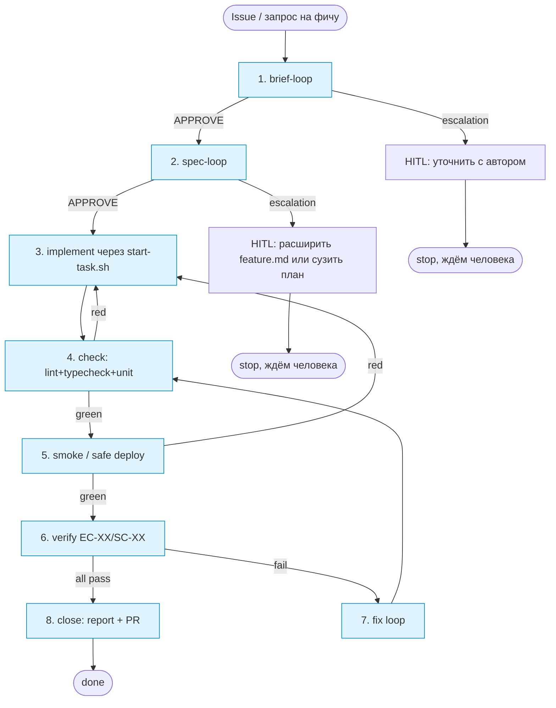

# Process Spec — Big Feature Loop

Канонический документ процесса. Источник истины для `homeworks/hw-4/scripts/run-feature.sh`.

## Назначение

Большой цикл: проводит фичу через **полный SDLC с сохраняемым состоянием** — от GitHub Issue
до завершённой фичи на безопасном тестовом контуре. Переиспользует малые циклы из задачи 1
(`brief-loop`, `spec-loop`) и оркестрационную инфраструктуру из HW-3 (`scripts/start-task.sh`).

Главное отличие от малых циклов: **состояние сохраняется между этапами**, прогон может быть
остановлен и продолжен в другой сессии без пересказа. Минимум один stop/resume в реальном прогоне — обязателен.

## 8 этапов

| # | Этап | Делает | Артефакт после этапа | State обновление |
|---|---|---|---|---|
| 1 | **Brief loop** | `run-loop.sh --loop brief --artifact <brief>` | `<FT-XXX>/brief.md` (APPROVE) | `state-pack/<id>/active-context.md` (current=spec, last_done=brief) |
| 2 | **Spec loop** | `run-loop.sh --loop spec --artifact <FT-XXX>/` | `<FT-XXX>/feature.md` + `implementation-plan.md` (APPROVE) | `active-context.md` (current=impl), `plan.md` (синхр. со STEP-XX) |
| 3 | **Implement** | `start-task.sh <branch> --type feature --issue <url>` | код + тесты по STEP-XX | `active-context.md` (current=check, branch=<name>) |
| 4 | **Check** | local lint + typecheck + unit тесты (`bin/test`, `npm test`, etc.) | green локально | `session-handoff.md` (фиксируем последний green commit) |
| 5 | **Smoke / safe deploy** | `scripts/test-ci.sh` + Docker E2E против локального стенда | smoke green | `session-handoff.md` (smoke evidence path) |
| 6 | **Verify (acceptance)** | проверка `EC-XX` / `SC-XX` из feature.md на смок-стенде | acceptance evidence записан в `artifacts/.../` | `active-context.md` (current=fix или done) |
| 7 | **Fix loop** | если acceptance нашёл проблемы — мини-цикл правок (новый STEP-XX, новый прогон 4-6) | новые коммиты, обновлённый evidence | `plan.md` (ставим STEP в DONE), `active-context.md` |
| 8 | **Close / handoff** | финальный отчёт (`runs/<id>/report.md`) + PR | PR со ссылками на feature.md, evidence, trace | финальный `session-handoff.md` (status=done/blocked/escalation) |

## Диаграмма процесса



После каждого этапа — обязательное обновление `state-pack/<id>/active-context.md`
(см. контракт состояния ниже). Без этого нельзя считать этап завершённым.

## Entry criteria

Большой цикл запускается, если:

- передан `--issue <url>` или `--brief <path>` (минимум один источник входной задачи);
- `feature-id` (например, `FT-020`) указан явно или генерируется из issue номера;
- репозиторий чистый (`git status` пустой) или у текущей ветки нет неcommitted-conflict'ов;
- есть активная zellij-сессия (для запуска вкладок-исполнителей);
- агенты `claude` и (опц.) `codex` доступны;
- `homeworks/hw-4/scripts/run-loop.sh` исполняемый и протестирован хотя бы раз.

## Exit criteria

Большой цикл успешно завершается (`status=done`), когда:

1. все 8 этапов выполнены, каждый имеет evidence в `artifacts/.../` или ссылку в `state-pack/<id>/active-context.md`;
2. `verify (этап 6)` зафиксировал, что **все** `EC-XX` из feature.md выполнены;
3. PR создан и пройден локальный smoke + CI;
4. `runs/<id>/report.md` содержит `STATUS: DONE` и ссылается на финальный коммит / PR;
5. `state-pack/<id>/session-handoff.md` помечен `status: closed`.

## Escalation rules

Большой цикл останавливается **на конкретном этапе** и фиксирует stop/resume в state, если:

- **этап 1** (brief-loop) вернул `escalation` → `STATUS: ESCALATION` (HITL: автор issue должен уточнить контекст);
- **этап 2** (spec-loop) вернул `escalation` → `STATUS: ESCALATION` (HITL: scope creep / план требует расширения feature.md);
- **этап 3** (implement) — агент в worktree остановился сам и оставил TODO в state → `STATUS: BLOCKED` (resume: подключиться к табу, продолжить работу);
- **этап 4** (check) — > 2 раз подряд тесты падают с одной и той же ошибкой и agent не находит fix → `STATUS: BLOCKED` (resume: human debug);
- **этап 5** (smoke) — не работает Docker / стенд падает → `STATUS: BLOCKED` (resume: починить стенд);
- **этап 6** (verify) — нашёл проблему, но ни один из STEP-XX в плане её не покрывает → `STATUS: ESCALATION` (нужно дописать feature.md с новым `EC-XX`);
- **этап 7** (fix loop) — > 3 циклов fix без сходимости → `STATUS: ESCALATION` (HITL: пересмотреть подход);
- **этап 8** (close) — CI красный после rebase → `STATUS: BLOCKED`.

В любом из этих случаев `runs/<id>/report.md` и `session-handoff.md` точно описывают,
где остановились и как продолжить (команда + ссылки).

## Контракт состояния (state-pack)

Каталог: `homeworks/hw-4/state-pack/<feature-id>/`. Минимум 3 файла.

### `active-context.md` — где сейчас

Обновляется после каждого этапа. Содержит:

- `feature_id`, `issue_url`, `branch_name` (если уже создана)
- `current_stage` (1..8), `last_completed_stage`
- `last_action_at` (timestamp)
- `next_action` (одно предложение: что делать в следующем заходе)
- ссылки на все promтр промт- и runner-файлы для текущего этапа
- если `current_stage` помечен `BLOCKED` или `ESCALATION` — раздел `## Blocker` с описанием проблемы

### `plan.md` — что планируется и что сделано

Зеркалит `## Порядок работ` из `implementation-plan.md`, но добавляет колонку `Done`:

```
| STEP-XX | Goal | Implements | Verifies | Done | Note |
```

Обновляется после этапа 7 (fix loop) и при переходе к этапу 8.

### `session-handoff.md` — что нужно знать следующей сессии

Краткое (≤80 строк) summary для случая «новая сессия начинает работу по этой фиче»:

- что уже готово
- какие state-файлы нужно прочитать первыми
- какая команда продолжает прогон
- где лежат evidence (с путями)

Обновляется в момент любого stop (планового перерыва или escalation), и финально на этапе 8.

## Runner contract

`homeworks/hw-4/scripts/run-feature.sh \
  --feature-id <id> \
  --issue <url-or-path> \
  [--from-stage <N>] \
  [--session <name>] \
  [--max-fix-iters 3]`

Поведение:

- если `--from-stage` не указан — стартует с этапа 1.
- если в `state-pack/<id>/active-context.md` уже есть прогресс — runner предлагает `resume from stage <last_completed+1>` (intercative confirm: `y/n`); в non-interactive режиме (CI) — авто-resume.
- runner оркестрирует этапы строго последовательно, но НЕ блокирует zellij-таб с агентом — он лишь стартует таб (через `start-task.sh` или `run-loop.sh`) и затем поллит state/verdict-файлы.
- между этапами runner обновляет `active-context.md` атомарно (`mv` через temp-файл).
- при любом завершении (`done`/`blocked`/`escalation`) — пишет `runs/<id>/report.md` и `session-handoff.md`, печатает финальный статус.

## Артефакты, которые runner возвращает / обновляет

| Артефакт | Состояние до | Состояние после |
|---|---|---|
| `.memory-bank/features/<FT-XXX>/brief.md` | issue body / черновик | brief APPROVE |
| `.memory-bank/features/<FT-XXX>/feature.md` | черновик / нет | feature.md APPROVE |
| `.memory-bank/features/<FT-XXX>/implementation-plan.md` | черновик / нет | план APPROVE без scope creep |
| код в `app/` или `src/` | до фичи | + новые файлы / правки по STEP-XX |
| тесты | до фичи | + Vitest/RSpec кейсы по `CHK-XX` |
| `artifacts/<FT-XXX>/` | пусто | evidence-файлы, на которые ссылаются `EVID-XX` |
| `state-pack/<id>/{active-context,plan,session-handoff}.md` | возможно есть от предыдущего захода | актуальное состояние |
| `runs/<id>/{trace.md,report.md,iter-N.log}` | — | хронология и финальный статус прогона |
| GitHub PR | — | PR со ссылками на feature.md, evidence и report |

## Связь с малыми циклами

Большой цикл **не дублирует** работу малых, а **вызывает** их runner'ом:

- этап 1: `run-loop.sh --loop brief`
- этап 2: `run-loop.sh --loop spec`

Если малый цикл вернул `escalation`, большой цикл останавливается с тем же статусом, не пытаясь
обойти проверку.

## HITL точки

Явные точки, где автономия останавливается и ждёт человека:

- **между этапом 2 и 3** (опционально): подтверждение, что план готов к реализации. Можно отключить флагом `--auto-approve-spec`, но по умолчанию — confirm.
- **между этапом 7 и 8** (всегда): человек смотрит финальный diff перед PR.
- **любой `escalation`**: runner печатает причину и команду resume; не действует дальше.

## Связанные материалы

- [`prompt.md`](prompt.md) — стартовый промпт для исполнителя большого цикла
- [`../scripts/run-feature.sh`](../scripts/run-feature.sh) — реализация runner'а
- [`../brief-loop/process-spec.md`](../brief-loop/process-spec.md), [`../spec-loop/process-spec.md`](../spec-loop/process-spec.md)
- [`../../../scripts/start-task.sh`](../../../scripts/start-task.sh) — переиспользуется на этапе 3
- [`../../../docs/orchestration/routing.md`](../../../docs/orchestration/routing.md) — типы задач для start-task
