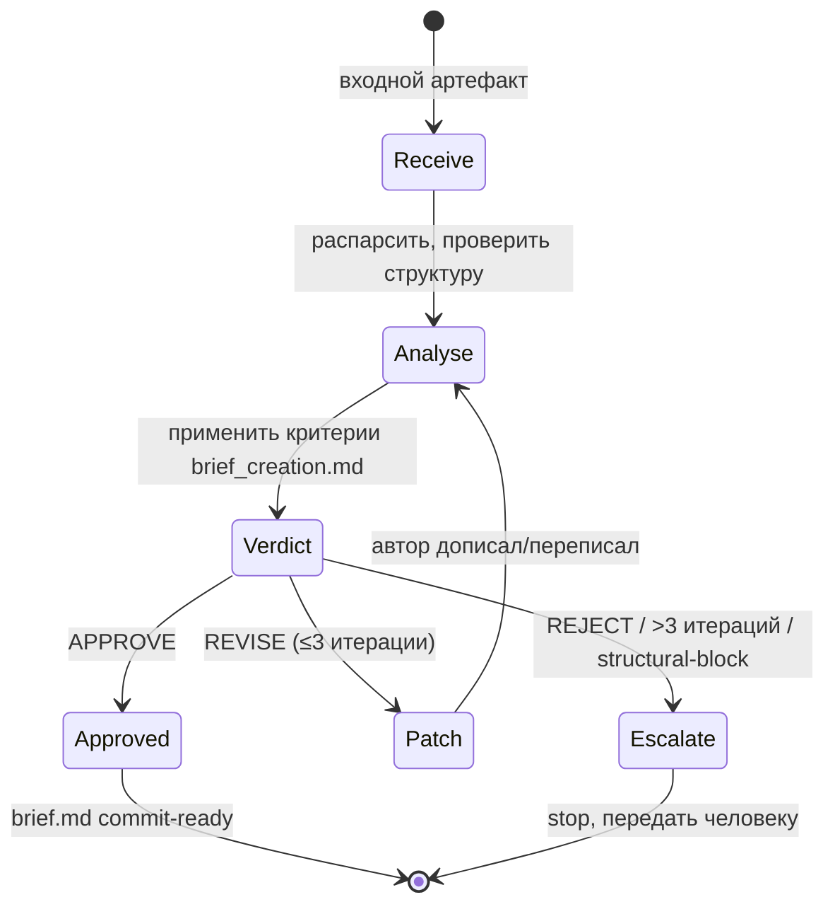

# Process Spec — Brief Improve Loop

Канонический документ процесса. Источник истины для `homeworks/hw-4/scripts/run-loop.sh --loop brief`.

## Назначение

Малый цикл улучшения **Brief** (входной артефакт SDD). Принимает черновик
(`docs/briefs/<slug>.md`, GitHub Issue body, `.memory-bank/features/FT-XXX/brief.md` или фрагмент из чата),
доводит его до состояния, в котором его можно безопасно отдать на следующий шаг (`spec-loop`).

Контракт качества — `eval/prompts/brief_creation.md` (4 секции: «Проблема / Для кого / Контекст / Желаемый результат», ≤1 уровень `##`, без описания решения).

## Диаграмма процесса

## Entry criteria

Цикл запускается, если:

- `INPUT_PATH` существует и читаем (markdown или plain text);
- размер ≤ 8 KB (если больше — это уже не brief, escalate сразу);
- агент `claude` доступен в PATH (см. `scripts/start-task.sh:201`);
- среда — git-репозиторий (для возможности коммита результата).

## Exit criteria

Цикл успешно завершается (`status=done`), когда:

1. ревью-промпт (`prompt.md`) выдаёт первой строкой `APPROVE: 0 замечаний`;
2. документ содержит ровно 4 обязательные секции на уровне `##`:
   `## Проблема`, `## Для кого`, `## Контекст`, `## Желаемый результат`;
3. в `## Проблема` отсутствуют слова с корнями `быстр-`, `удоб-`, `легк-` и упоминания конкретных
   технологий/UI-элементов (см. `eval/prompts/brief_creation.md`);
4. итоговый файл записан по `OUTPUT_PATH` и не имеет diff с предыдущей итерацией (стабилизировался).

## Escalation rules

Цикл останавливается без `done` (`status=blocked` или `escalation`), если:

- **>3 итераций ревью** на одном входе → `escalation`. Вероятно, brief требует уточнения у автора задачи / стейкхолдера.
- ревьюер выдал `REJECT` (структура исходно неверная, надо пересобирать) → `escalation`.
- между итерациями входной артефакт не меняется (loop крутится впустую) → `blocked`. Останавливаемся, человек смотрит почему.
- агент превысил token budget (>30K) → `blocked`. Brief столько не должен весить.

В `escalation` runner записывает в `runs/<id>/report.md` строку `STATUS: ESCALATION` и причину.

## Runner contract

`scripts/run-loop.sh --loop brief --artifact <path> [--max-iters 3] [--session <name>]`

Runner обязан:

- читать `homeworks/hw-4/brief-loop/prompt.md` как системный промпт (не модифицировать на лету);
- при каждой итерации:
  - подкладывать текущее содержимое `<artifact>` в плейсхолдер `{{issue}}` промпта;
  - запускать `claude` в новом zellij-табе с готовым launch-скриптом (как делает `start-task.sh`);
  - дожидаться, пока агент запишет результат в `<artifact>` и выйдет;
- логировать каждую итерацию в `runs/<run-id>/iter-<N>.log`;
- обновлять `runs/<run-id>/trace.md`: timestamp, итерация, verdict (APPROVE/REVISE/REJECT), действия;
- по завершении (любой статус) — записать `runs/<run-id>/report.md` со статусом и финальным diff артефакта.

## Артефакты, которые runner возвращает / обновляет

| Артефакт | Состояние до | Состояние после |
|---|---|---|
| `<artifact>` (вход) | черновик любого качества | brief, прошедший APPROVE, либо не изменился (если escalation) |
| `runs/<run-id>/iter-N.log` | — | stdout агента + verdict ревьюера на каждую итерацию |
| `runs/<run-id>/trace.md` | — | хронологическая запись: что прочитали, что попросили, что получили |
| `runs/<run-id>/report.md` | — | финальный статус: `done` / `blocked` / `escalation`, кол-во итераций, время |

## Связь с большим циклом

`big-loop/run-feature.sh` вызывает этот runner на этапе 1 (см. `big-loop/process-spec.md`).
Если brief-loop вернул `escalation`, большой цикл останавливается на HITL и не идёт в spec-loop.

## Связанные материалы

- [`prompt.md`](prompt.md) — системный промпт (контракт качества brief)
- [`../scripts/run-loop.sh`](../scripts/run-loop.sh) — реализация runner'а
- [`../../../eval/prompts/brief_creation.md`](../../../eval/prompts/brief_creation.md) — критерии brief, на которые ссылается этот цикл
- [`../../../eval/promptfooconfig.feature-reviewer.yaml`](../../../eval/promptfooconfig.feature-reviewer.yaml) — Promptfoo-кейсы, которые валидируют поведение промпта вне runner'а
