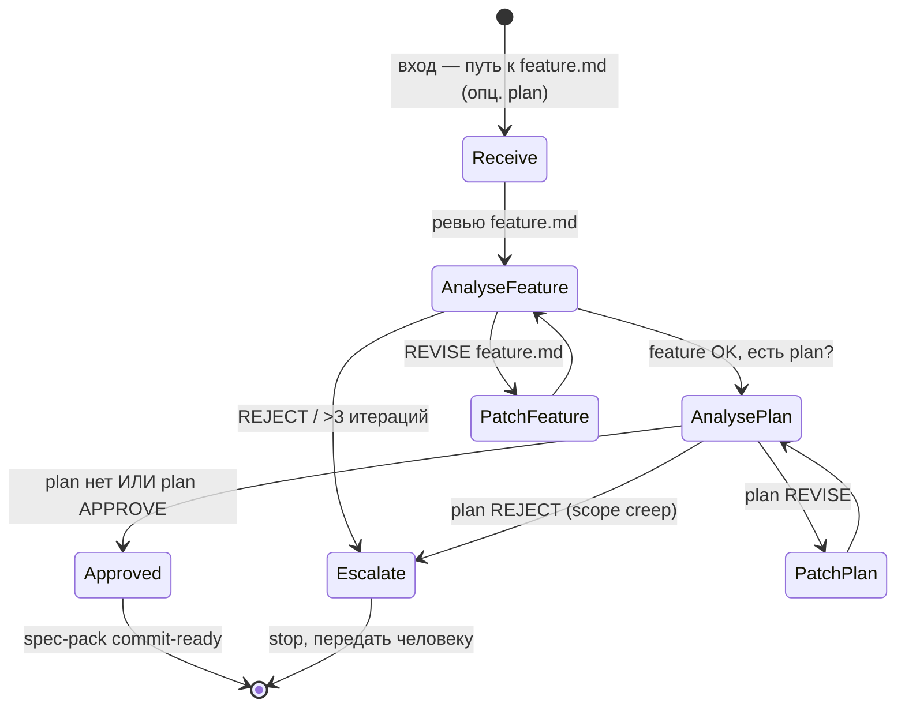

# Process Spec — Spec Improve Loop

Канонический документ процесса. Источник истины для `homeworks/hw-4/scripts/run-loop.sh --loop spec`.

## Назначение

Малый цикл улучшения комплекта **Spec**: `feature.md` (главный canonical-документ) и опционально `implementation-plan.md` (sibling). Принимает черновик из `.memory-bank/features/FT-XXX/`, доводит до состояния, в котором его можно отдать на implement.

Контракт качества — `eval/prompts/feature_reviewer.md` (структурные + содержательные критерии формата FT-XXX) и `eval/prompts/feature_implement_plan_reviewer.md` (если в комплекте есть `implementation-plan.md`).

## Диаграмма процесса

## Entry criteria

Цикл запускается, если:

- `INPUT_PATH` указывает на каталог `.memory-bank/features/FT-XXX/` или конкретный `feature.md`;
- в каталоге есть `feature.md` (обязательно) и опционально `implementation-plan.md`;
- предыдущий шаг (brief-loop) завершён со `status=done` для соответствующего brief'а — или brief сразу был готов и пропущен;
- агент `claude` доступен в PATH;
- среда — git-репозиторий.

## Exit criteria

Цикл успешно завершается (`status=done`), когда:

1. ревью `feature.md` (`prompt.md` секция `feature_review`) выдаёт `APPROVE: 0 замечаний, feature готов к implementation-plan.`;
2. если в комплекте есть `implementation-plan.md`, ревью плана (`prompt.md` секция `plan_review`) выдаёт `APPROVE: 0 замечаний, план готов к execution.`;
3. **scope-инвариант**: если есть и feature, и plan — план не вводит **ни одного** идентификатора `REQ-XX/CTR-XX/CHK-XX/EVID-XX/EC-XX`, которого нет в feature (см. правило 1 в `feature_implement_plan_reviewer.md`);
4. оба файла записаны на диск и не имеют diff с предыдущей итерацией.

## Escalation rules

Цикл останавливается со `status=blocked` или `escalation`, если:

- **>3 итераций ревью** на одном из документов → `escalation`. Spec не сходится за разумное время — нужен человек.
- ревьюер выдал `REJECT` на feature.md (формат фундаментально неправильный) → `escalation`.
- план содержит scope creep (новые `REQ-XX`/`CHK-XX`, отсутствующие в feature.md) и автор-агент не может это исправить без расширения feature.md → `escalation` с пометкой «расширить feature.md или сократить scope плана».
- token budget превышен (> 60K на одной итерации) → `blocked`.
- между итерациями документ не меняется → `blocked`.

В `escalation` runner записывает в `runs/<id>/report.md` строку `STATUS: ESCALATION` и причину.

## Runner contract

`scripts/run-loop.sh --loop spec --artifact <path-to-feature.md-or-FT-dir> [--max-iters 3] [--session <name>]`

Runner обязан:

- определить, что на входе:
  - если `<path>` — файл `feature.md`, plan не ревьюится;
  - если `<path>` — каталог, искать в нём `feature.md` (обязательно) и `implementation-plan.md` (опционально);
- читать `homeworks/hw-4/spec-loop/prompt.md` как системный промпт;
- на каждой итерации:
  - если ещё не APPROVE для feature → ревью feature, при REVISE — патч агентом, повтор;
  - если feature APPROVE и plan существует и не APPROVE → ревью plan, при REVISE — патч, повтор;
  - запускать `claude` в новом zellij-табе с launch-скриптом;
  - дожидаться выхода агента и финального verdict'а;
- логировать каждую итерацию в `runs/<run-id>/iter-<N>.log`;
- обновлять `runs/<run-id>/trace.md`;
- финализировать `runs/<run-id>/report.md` со статусом и финальным diff.

## Артефакты, которые runner возвращает / обновляет

| Артефакт | Состояние до | Состояние после |
|---|---|---|
| `<dir>/feature.md` | черновик с TBD/orphans | feature.md, прошедший APPROVE |
| `<dir>/implementation-plan.md` (если есть) | черновик плана | план без scope creep, APPROVE |
| `runs/<run-id>/iter-N.log` | — | stdout агента + verdict ревьюера |
| `runs/<run-id>/trace.md` | — | хронология итераций по каждому документу |
| `runs/<run-id>/report.md` | — | финальный статус, кол-во итераций по feature и plan |

## Связь с большим циклом

`big-loop/run-feature.sh` вызывает этот runner на этапе 2. Если spec-loop вернул `escalation` —
большой цикл не идёт в implement, останавливается на HITL.

## Связанные материалы

- [`prompt.md`](prompt.md) — системный промпт (включает оба ревьюера и порядок итераций)
- [`../scripts/run-loop.sh`](../scripts/run-loop.sh) — реализация runner'а
- [`../../../eval/prompts/feature_reviewer.md`](../../../eval/prompts/feature_reviewer.md) — критерии feature.md
- [`../../../eval/prompts/feature_implement_plan_reviewer.md`](../../../eval/prompts/feature_implement_plan_reviewer.md) — критерии плана
- [`../../../eval/promptfooconfig.feature-reviewer.yaml`](../../../eval/promptfooconfig.feature-reviewer.yaml), [`../../../eval/promptfooconfig.plan-reviewer.yaml`](../../../eval/promptfooconfig.plan-reviewer.yaml) — Promptfoo-кейсы
